# HungrySnake
Snake game with challenging levels (Inspired by the classic "Snake Xenxia" in old nokia phones) written in C.

## Features:
1. 9 challenging maps.
2. Unicode characters used to make the snake appear as a continuous connected path instead of a blob.
3. Efficient algorithm: movement, collision check, random food are all O(1).
4. Memory efficient and no heap allocations.

## Dependencies
1. libtermkey
2. A font supporting unicode symbols for legacy computing supplement: block octant characters (most fonts do support these characters).

## Compiling
``gcc ./*.c -O2 -ltermkey -o snake``

## Algorithm
1. Two arrays z and p of length equal to number grid cells.
2. Integer nz tracks the number of empty cells.
3. z stores positions of empty cells upto index nz-1. p[i] stores where i can be found in z.
4. For i < nz, there is a bijective mapping of position between z and p i.e. p[z[i]] = i.
5. The rest of the arrays store the snake's body as index based sort of linked lists.
This enables O(1) operations and one less data-structure for storing the snake's body.

This image shows how to put a new head

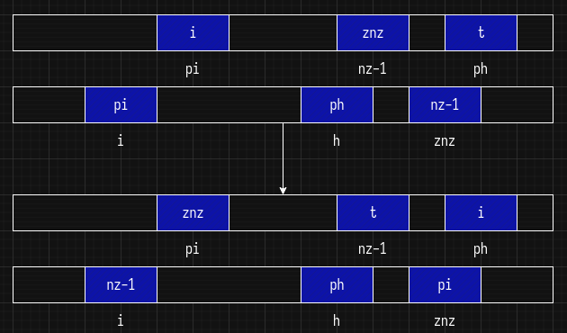

This image shows how to cut the tail

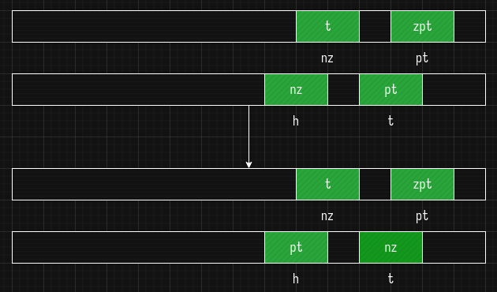

## Screenshots
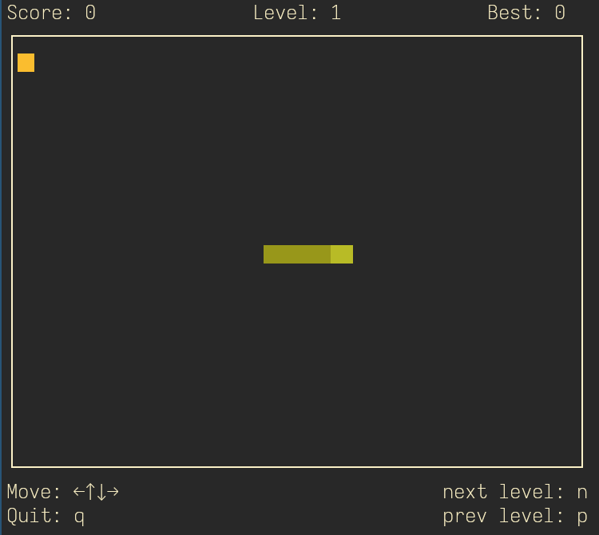
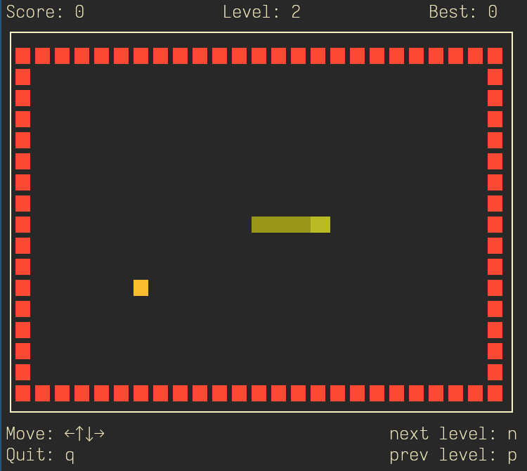
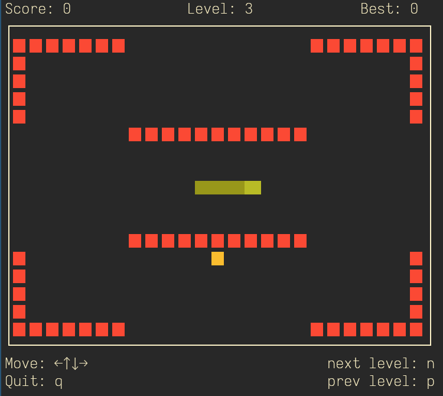
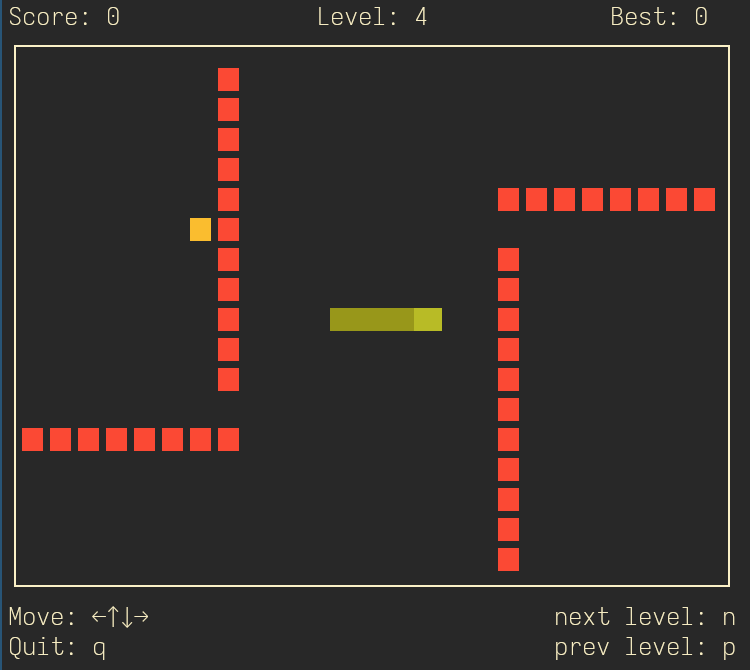
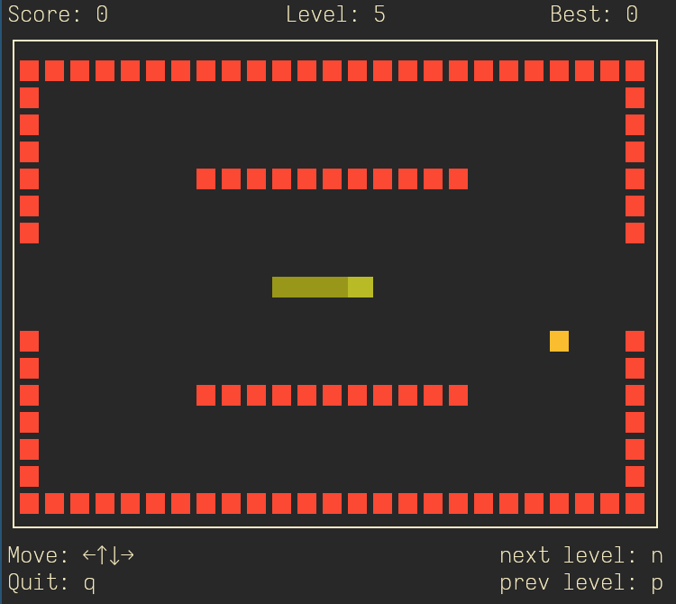
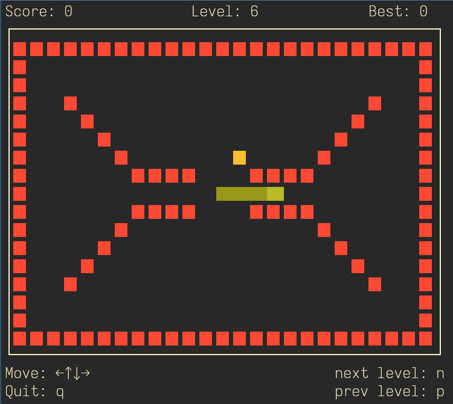
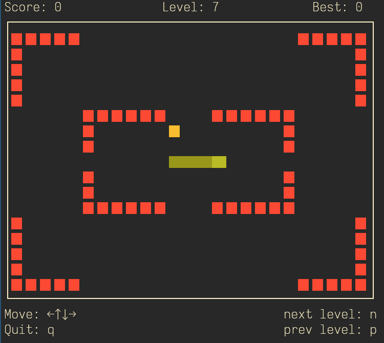
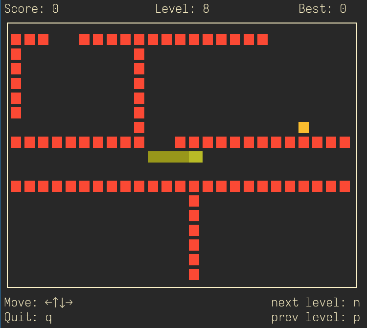
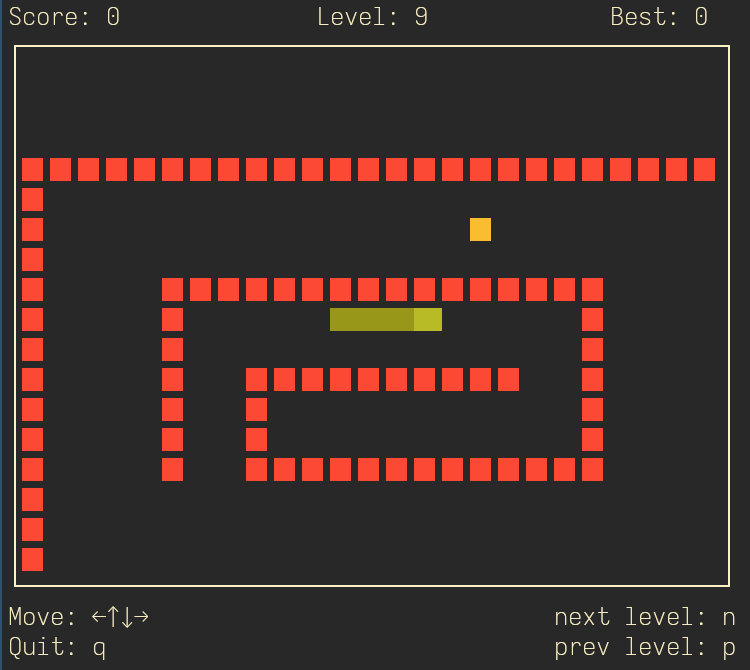
